# 🌱 Agni Farm - Website Blueprint

> **Dokumen Perencanaan Lengkap untuk Pengembangan Website Profil Bisnis Agni Farm**

---

## 📋 Ikhtisar Proyek

| Aspek               | Detail                                                   |
| ------------------- | -------------------------------------------------------- |
| **Nama Bisnis**     | Agni Farm                                                |
| **Tipe Website**    | Company Profile + Product Catalog                        |
| **Framework**       | Laravel 12                                               |
| **Database**        | MySQL                                                    |
| **Target Audience** | Pelanggan pertanian, pembeli online, dan masyarakat umum |

---

## 🎨 Design Philosophy

### Tema Visual: **"Nature Meets Technology"**

Konsep desain menggabungkan estetika **Glassmorphism** dengan elemen **3D Subtle** untuk menciptakan tampilan yang:

- Modern dan fresh
- Premium namun ramah
- Berbeda dari kompetitor (menghindari tampilan flat/boxy seperti infarm.co.id)

### ❌ Yang Dihindari (Dari Referensi infarm.co.id)


- ❌ Desain flat dan boxy
- ❌ Tipografi generik
- ❌ Layout linear tanpa visual hierarchy
- ❌ Warna kusam dan tidak menarik
- ❌ Kurangnya micro-interactions dan animasi
- ❌ Tidak ada elemen modern (shadows, gradients, glass effect)

### ✅ Inspirasi (Dari Shopee Store)


- ✅ Layout yang clean dan terorganisir
- ✅ Visual hierarchy yang jelas
- ✅ Penggunaan warna yang menarik
- ✅ Product presentation yang profesional

---

## 🎨 Color Palette

### Primary Colors

| Nama             | Hex Code  | Preview | Penggunaan                        |
| ---------------- | --------- | ------- | --------------------------------- |
| **Forest Green** | `#166534` | 🟩      | Primary buttons, headers, accents |
| **Leaf Green**   | `#22C55E` | 🟢      | Hover states, highlights          |
| **Light Sage**   | `#DCFCE7` | 🟩      | Backgrounds, cards                |

### Secondary Colors

| Nama            | Hex Code  | Preview | Penggunaan                     |
| --------------- | --------- | ------- | ------------------------------ |
| **Warm Orange** | `#F97316` | 🟧      | CTA buttons, important accents |
| **Amber Glow**  | `#FBBF24` | 🟡      | Badges, notifications          |
| **Soft Cream**  | `#FEF7ED` | 🟨      | Alternative backgrounds        |

### Neutral Colors

| Nama              | Hex Code  | Preview | Penggunaan             |
| ----------------- | --------- | ------- | ---------------------- |
| **Pure White**    | `#FFFFFF` | ⬜      | Main background, cards |
| **Light Gray**    | `#F8FAFC` | ⬜      | Section backgrounds    |
| **Medium Gray**   | `#64748B` | 🔲      | Secondary text         |
| **Dark Charcoal** | `#1E293B` | ⬛      | Primary text, headings |

### Glassmorphism Variables

```css
:root {
  /* Glass Effects */
  --glass-bg: rgba(255, 255, 255, 0.7);
  --glass-border: rgba(255, 255, 255, 0.5);
  --glass-blur: 20px;

  /* Shadows */
  --shadow-sm: 0 2px 8px rgba(0, 0, 0, 0.05);
  --shadow-md: 0 4px 16px rgba(0, 0, 0, 0.08);
  --shadow-lg: 0 8px 32px rgba(0, 0, 0, 0.12);
  --shadow-glow: 0 0 40px rgba(34, 197, 94, 0.15);

  /* Gradients */
  --gradient-primary: linear-gradient(135deg, #166534 0%, #22c55e 100%);
  --gradient-hero: linear-gradient(180deg, #dcfce7 0%, #ffffff 100%);
  --gradient-card: linear-gradient(145deg, #ffffff 0%, #f8fafc 100%);
}
```

---

## 🏷️ Logo Design

### Konsep Logo


**Filosofi Logo:**

- **Agni** = Api dalam bahasa Sanskerta, melambangkan semangat, energi, dan transformasi
- **Farm** = Pertanian, melambangkan pertumbuhan dan alam
- Kombinasi elemen api dan daun/tanaman menciptakan simbol unik yang mewakili:
  - Semangat dalam bertani
  - Pertumbuhan yang kuat
  - Energi positif
  - Keharmonisan antara alam dan manusia

---

## 🗂️ Sitemap & Struktur Halaman

```mermaid
graph TD
    A[🏠 Homepage] --> B[📖 Tentang Kami]
    A --> C[📦 Catalog Produk]
    A --> E[📞 Kontak]

    C --> C1[Kategori Produk]
    C --> C2[Detail Produk]
    C2 --> C3[🛒 Redirect ke Shopee]

    F[🔐 Admin Panel] --> F1[Dashboard]
    F --> F2[Kelola Catalog]
    F --> F3[Kelola Kategori]
    F --> F4[Pengaturan]
```



---

## 📄 Detail Halaman

### 1. Homepage (Beranda)

#### Hero Section

- **Full-width hero** dengan gambar pertanian berkualitas tinggi
- **Glassmorphism overlay** untuk teks yang readable
- Headline menarik + Tagline
- CTA Button dengan animasi hover
- **Floating elements** (daun, tanaman) dengan animasi parallax subtle

#### Sections:

1. **About Preview** - Singkat tentang Agni Farm dengan animasi fade-in
2. **Featured Products** - Carousel produk unggulan dengan 3D card effect + link ke Shopee
3. **Product Categories** - Grid kategori produk dengan icon/image
4. **Testimonials** - Slider testimonial pelanggan
5. **CTA Section** - Ajakan untuk melihat catalog/menghubungi
6. **Footer** - Informasi lengkap + social media links + link Shopee store

### 2. Tentang Kami (About)

- Hero image dengan parallax effect
- Visi & Misi dengan glassmorphism cards
- Timeline sejarah perusahaan
- Team section (jika ada)
- Gallery foto-foto pertanian

### 3. Catalog Produk (Products)

> [!IMPORTANT] > **Halaman utama untuk menampilkan semua produk Agni Farm dengan link langsung ke Shopee**

#### Layout:

- **Hero section** dengan promo/banner produk unggulan
- **Filter & Search** - Filter kategori, search by name, sort by price
- **Product grid** dengan hover 3D effect
- **Pagination** atau infinite scroll

#### Product Card Contents:

| Element            | Deskripsi                                       |
| ------------------ | ----------------------------------------------- |
| **Image**          | Foto produk utama (hover untuk lihat foto lain) |
| **Name**           | Nama produk                                     |
| **Price**          | Harga dalam Rupiah (format: Rp XX.XXX)          |
| **Category Badge** | Label kategori produk                           |
| **Rating**         | Bintang rating (opsional, dari Shopee)          |
| **CTA Button**     | "Beli di Shopee" → redirect ke Shopee           |

#### Detail Produk Page:

- **Image Gallery** - Multiple images dengan zoom & swipe
- **Product Info:**
  - Nama produk
  - Harga
  - Deskripsi lengkap
  - Spesifikasi (berat, ukuran, dll)
  - Kategori
- **CTA Buttons:**
  - 🛒 **"Beli di Shopee"** (Primary) → Redirect ke link Shopee produk
  - 💬 **"Tanya via WhatsApp"** (Secondary) → Chat WA
- **Related Products** - Produk terkait dari kategori sama

```
┌─────────────────────────────────────────────┐
│  [Image Gallery]          [Product Info]    │
│  ┌─────────────┐          Nama Produk       │
│  │             │          ──────────────    │
│  │   IMAGE     │          Rp 150.000        │
│  │             │                            │
│  └─────────────┘          Deskripsi...      │
│  [⬤] [○] [○] [○]         ...                │
│                                             │
│                          [🛒 Beli di Shopee]│
│                          [💬 Chat WhatsApp] │
├─────────────────────────────────────────────┤
│  Related Products                           │
│  [Card] [Card] [Card] [Card]                │
└─────────────────────────────────────────────┘
```

### 5. Kontak

- Contact form dengan validasi real-time
- Google Maps embed
- Info kontak (alamat, telepon, email, WA)
- Social media links
- FAQ section (opsional)

---

## 🛠️ Admin Panel Features

### Dashboard

- Statistik pengunjung website
- Jumlah produk per kategori
- Produk terpopuler (most viewed)
- Quick actions (Tambah Produk, dll)
- Recent activities

### Manajemen Catalog Produk

> [!IMPORTANT] > **Form sederhana untuk menambah produk ke catalog dengan mudah**

#### Form Input Produk:

| Field                 | Tipe        | Keterangan                           |
| --------------------- | ----------- | ------------------------------------ |
| **Nama Produk**       | Text        | Wajib, max 200 karakter              |
| **Slug**              | Text        | Auto-generate dari nama              |
| **Kategori**          | Dropdown    | Pilih dari list kategori             |
| **Harga**             | Number      | Format Rupiah (Rp)                   |
| **Harga Diskon**      | Number      | Opsional, untuk promo                |
| **Deskripsi Singkat** | Textarea    | Max 300 karakter, untuk card         |
| **Deskripsi Lengkap** | Rich Text   | WYSIWYG editor sederhana             |
| **Spesifikasi**       | Key-Value   | Berat, Ukuran, dll                   |
| **Foto Produk**       | File Upload | Multiple images, drag & drop         |
| **Link Shopee**       | URL         | **WAJIB** - Link ke produk di Shopee |
| **Status**            | Toggle      | Aktif / Tidak Aktif                  |
| **Featured**          | Toggle      | Tampil di homepage                   |

#### Fitur Admin Catalog:

- ✅ **Drag & Drop Image Upload** - Upload multiple foto sekaligus
- ✅ **Image Reordering** - Atur urutan foto dengan drag
- ✅ **Auto Image Compression** - Otomatis compress untuk web
- ✅ **Quick Edit** - Edit langsung dari list tanpa buka halaman baru
- ✅ **Bulk Actions** - Hapus/aktifkan beberapa produk sekaligus
- ✅ **Duplicate Product** - Copy produk untuk variasi
- ✅ **Preview** - Lihat tampilan produk sebelum publish
- ✅ **Search & Filter** - Cari produk berdasarkan nama/kategori

#### Workflow Tambah Produk:


#### UI Form Admin:

```
┌─────────────────────────────────────────────────────┐
│  ➕ Tambah Produk Baru                    [Simpan]  │
├─────────────────────────────────────────────────────┤
│                                                     │
│  Nama Produk *                                      │
│  ┌─────────────────────────────────────────────┐   │
│  │ Bibit Tomat Cherry Premium                  │   │
│  └─────────────────────────────────────────────┘   │
│                                                     │
│  Kategori *              Harga *                    │
│  ┌──────────────┐       ┌──────────────────────┐   │
│  │ Bibit Sayur ▼│       │ Rp 25.000            │   │
│  └──────────────┘       └──────────────────────┘   │
│                                                     │
│  Deskripsi Singkat                                  │
│  ┌─────────────────────────────────────────────┐   │
│  │ Bibit tomat cherry unggul, hasil panen...   │   │
│  └─────────────────────────────────────────────┘   │
│                                                     │
│  Foto Produk                                        │
│  ┌─────────────────────────────────────────────┐   │
│  │  📷 Drop images here or click to upload     │   │
│  │  ┌────┐ ┌────┐ ┌────┐                       │   │
│  │  │img1│ │img2│ │ + │                        │   │
│  │  └────┘ └────┘ └────┘                       │   │
│  └─────────────────────────────────────────────┘   │
│                                                     │
│  Link Shopee *                                      │
│  ┌─────────────────────────────────────────────┐   │
│  │ https://shopee.co.id/product/123456         │   │
│  └─────────────────────────────────────────────┘   │
│                                                     │
│  ☑ Tampilkan di Homepage    ☑ Aktif                │
│                                                     │
│  [Preview]                         [💾 Simpan]     │
└─────────────────────────────────────────────────────┘
```

### Manajemen Kategori

- CRUD kategori produk
- Icon/image untuk kategori
- Urutan tampilan (drag & drop)
- Jumlah produk per kategori

---

## 🗄️ Database Schema


### Contoh Data Produk:

```json
{
  "id": 1,
  "name": "Bibit Tomat Cherry Premium",
  "slug": "bibit-tomat-cherry-premium",
  "category": {
    "id": 1,
    "name": "Bibit Sayur"
  },
  "short_description": "Bibit tomat cherry unggul dengan hasil panen lebat",
  "full_description": "<p>Bibit tomat cherry premium...</p>",
  "price": 25000,
  "discount_price": null,
  "shopee_link": "https://shopee.co.id/product/123456",
  "images": [
    { "path": "/products/tomat-1.webp", "is_primary": true },
    { "path": "/products/tomat-2.webp", "is_primary": false }
  ],
  "specifications": [
    { "key": "Isi", "value": "50 biji" },
    { "key": "Waktu Panen", "value": "60-70 hari" }
  ],
  "is_featured": true,
  "is_active": true
}
```

---

## 🎭 UI/UX Components

### Glassmorphism Cards

```css
.glass-card {
  background: rgba(255, 255, 255, 0.7);
  backdrop-filter: blur(20px);
  -webkit-backdrop-filter: blur(20px);
  border: 1px solid rgba(255, 255, 255, 0.5);
  border-radius: 24px;
  box-shadow: 0 8px 32px rgba(0, 0, 0, 0.1);
}
```

### 3D Card Effect

```css
.product-card {
  transition: transform 0.4s ease, box-shadow 0.4s ease;
  transform-style: preserve-3d;
}

.product-card:hover {
  transform: translateY(-10px) rotateX(5deg);
  box-shadow: 0 20px 40px rgba(22, 101, 52, 0.2);
}
```

### Micro-Animations

- Button hover: Scale + glow effect
- Card hover: Lift + shadow
- Page transitions: Fade + slide
- Scroll reveal: Elements fade in from bottom
- Loading states: Skeleton loaders

### Interactive Elements

- Floating action button (WhatsApp)
- Scroll to top button
- Interactive navigation
- Animated hamburger menu (mobile)
- Smooth scrolling

---

## 📱 Responsive Design (Mobile-First)

> [!IMPORTANT] > **Website WAJIB 100% Responsive di semua ukuran layar, terutama Mobile.**
> Pendekatan **Mobile-First** akan digunakan - desain dimulai dari mobile, lalu scale up ke tablet dan desktop.

### Breakpoints System

```css
/* Mobile First Approach */
:root {
  /* Base (Mobile) - 320px to 767px */
  --breakpoint-xs: 320px; /* Small phones */
  --breakpoint-sm: 480px; /* Large phones */

  /* Tablet - 768px to 1023px */
  --breakpoint-md: 768px; /* Tablets portrait */
  --breakpoint-lg: 992px; /* Tablets landscape */

  /* Desktop - 1024px and above */
  --breakpoint-xl: 1024px; /* Small laptops */
  --breakpoint-2xl: 1280px; /* Desktops */
  --breakpoint-3xl: 1536px; /* Large screens */
}

/* Media Query Examples */
@media (min-width: 768px) {
  /* Tablet and up */
}
@media (min-width: 1024px) {
  /* Desktop and up */
}
@media (max-width: 767px) {
  /* Mobile only */
}
```

### 📲 Mobile Layout Specifications

#### Navigation (Mobile)

| Element            | Specification                                    |
| ------------------ | ------------------------------------------------ |
| **Header**         | Fixed top, tinggi 60px, glassmorphism background |
| **Logo**           | Tinggi max 40px, di kiri                         |
| **Hamburger Menu** | 44x44px touch target, di kanan                   |
| **Mobile Menu**    | Full-screen overlay dengan animasi slide-in      |
| **Menu Items**     | Font 18px, padding 16px, separator lines         |

```
┌─────────────────────────────────┐
│ [Logo]              [☰ Menu]   │  ← Header 60px
├─────────────────────────────────┤
│                                 │
│      Mobile Content Area        │
│                                 │
├─────────────────────────────────┤
│ [🏠] [🌾] [📝] [📞] [💬 WA]    │  ← Bottom Nav 65px
└─────────────────────────────────┘
```

#### Bottom Navigation (Mobile Only)

- **Tinggi:** 65px + safe area padding
- **Items:** 5 icons (Home, Produk, Artikel, Kontak, WhatsApp)
- **Icon size:** 24px
- **Label:** 10px font
- **Active state:** Warna primary + scale effect
- **Sticky** di bagian bawah layar

#### Touch Targets

| Element          | Minimum Size   |
| ---------------- | -------------- |
| Buttons          | 44px × 44px    |
| Form inputs      | Height 48px    |
| Links dalam text | Padding 8px    |
| Cards            | Full width tap |
| Close buttons    | 48px × 48px    |

### 📱 Component Behavior per Breakpoint

#### Hero Section

| Breakpoint              | Layout                                            |
| ----------------------- | ------------------------------------------------- |
| **Mobile (< 768px)**    | Single column, image di atas text, CTA full-width |
| **Tablet (768-1023px)** | Image dan text side-by-side 50/50                 |
| **Desktop (≥ 1024px)**  | Image 60%, text 40%, floating elements aktif      |

#### Product Grid

| Breakpoint              | Columns   | Card Style         |
| ----------------------- | --------- | ------------------ |
| **Mobile (< 480px)**    | 1 column  | Full width cards   |
| **Mobile (480-767px)**  | 2 columns | Compact cards      |
| **Tablet (768-1023px)** | 3 columns | Medium cards       |
| **Desktop (≥ 1024px)**  | 4 columns | Full feature cards |

#### Article Grid

| Breakpoint              | Layout                          |
| ----------------------- | ------------------------------- |
| **Mobile (< 768px)**    | Single column, horizontal cards |
| **Tablet (768-1023px)** | 2 columns grid                  |
| **Desktop (≥ 1024px)**  | 3 columns + sidebar             |

### 📲 Mobile-Specific Features

#### 1. Swipe Gestures

```javascript
// Implementasi swipe untuk:
- Product carousel: Swipe left/right
- Testimonials: Swipe left/right
- Image gallery: Swipe + zoom
- Mobile menu: Swipe right to close
```

#### 2. Pull-to-Refresh

- Artikel list: Pull down untuk refresh
- Produk list: Pull down untuk refresh

#### 3. Floating WhatsApp Button

```
Position: Fixed
Bottom: 80px (above bottom nav)
Right: 16px
Size: 56px × 56px
Animation: Pulse + bounce on scroll stop
```

#### 4. Mobile Form Optimization

- **Input types:** Gunakan type yang tepat (tel, email, number)
- **Autocomplete:** Enable untuk form fields
- **Keyboard:** Input focus smooth scroll
- **Validation:** Real-time dengan pesan error inline

### 📐 Typography Scaling

```css
:root {
  /* Mobile typography */
  --font-size-xs: 0.75rem; /* 12px */
  --font-size-sm: 0.875rem; /* 14px */
  --font-size-base: 1rem; /* 16px - minimum untuk body */
  --font-size-lg: 1.125rem; /* 18px */
  --font-size-xl: 1.25rem; /* 20px */
  --font-size-2xl: 1.5rem; /* 24px */
  --font-size-3xl: 2rem; /* 32px */
}

/* Heading scaling */
h1 {
  font-size: 1.75rem; /* Mobile: 28px */
}
h2 {
  font-size: 1.5rem; /* Mobile: 24px */
}

@media (min-width: 768px) {
  h1 {
    font-size: 2.5rem;
  } /* Tablet: 40px */
  h2 {
    font-size: 2rem;
  } /* Tablet: 32px */
}

@media (min-width: 1024px) {
  h1 {
    font-size: 3.5rem;
  } /* Desktop: 56px */
  h2 {
    font-size: 2.5rem;
  } /* Desktop: 40px */
}
```

### 🖼️ Image Optimization for Mobile

```html
<!-- Responsive Images dengan srcset -->
<picture>
  <source
    media="(max-width: 767px)"
    srcset="image-mobile.webp 1x, image-mobile@2x.webp 2x"
  />
  <source
    media="(min-width: 768px)"
    srcset="image-desktop.webp 1x, image-desktop@2x.webp 2x"
  />
  
</picture>
```

| Image Type        | Mobile Size | Desktop Size |
| ----------------- | ----------- | ------------ |
| Hero              | 768px wide  | 1920px wide  |
| Product thumbnail | 300px       | 600px        |
| Catalog Product   | 400px       | 800px        |
| Gallery           | 400px       | 1200px       |

### ⚡ Mobile Performance

| Metric                       | Target  |
| ---------------------------- | ------- |
| **First Contentful Paint**   | < 1.8s  |
| **Largest Contentful Paint** | < 2.5s  |
| **Time to Interactive**      | < 3.8s  |
| **Cumulative Layout Shift**  | < 0.1   |
| **Total Bundle Size**        | < 500KB |

#### Performance Strategies:

- ✅ Lazy loading untuk images dan komponen below-fold
- ✅ Critical CSS inline
- ✅ Defer non-critical JavaScript
- ✅ Image compression (WebP dengan fallback)
- ✅ Font subsetting (Latin only)
- ✅ Skeleton loading states
- ✅ Service Worker untuk offline support

### 📱 Mobile Testing Checklist

#### Devices to Test:

- [ ] iPhone SE (375px)
- [ ] iPhone 12/13/14 (390px)
- [ ] iPhone 12/13/14 Pro Max (428px)
- [ ] Samsung Galaxy S21 (360px)
- [ ] Samsung Galaxy S21 Ultra (384px)
- [ ] iPad Mini (768px)
- [ ] iPad Pro (1024px)

#### Features to Verify:

- [ ] Navigation menu opens/closes smoothly
- [ ] Bottom navigation works correctly
- [ ] All touch targets are 44px minimum
- [ ] Forms are easy to fill on mobile
- [ ] Images load properly dan tidak blur
- [ ] Carousels swipe smoothly
- [ ] Text readable tanpa zoom (16px minimum)
- [ ] No horizontal scroll
- [ ] WhatsApp button accessible
- [ ] Page speed < 3 seconds on 3G

### 🎨 Mobile-Specific UI Elements

#### Mobile Card Design

```css
.card-mobile {
  width: 100%;
  border-radius: 16px;
  padding: 16px;
  margin-bottom: 12px;
  /* No 3D effects on mobile - better performance */
  box-shadow: var(--shadow-sm);
}

.card-mobile:active {
  transform: scale(0.98);
  transition: transform 0.1s ease;
}
```

#### Mobile Button Styles

```css
.btn-mobile {
  width: 100%;
  height: 48px;
  border-radius: 12px;
  font-size: 16px;
  font-weight: 600;
  /* Haptic feedback on tap */
}

.btn-mobile:active {
  transform: scale(0.97);
}
```

---

## ⚙️ Technical Stack

### Backend

| Technology           | Purpose            |
| -------------------- | ------------------ |
| Laravel 12           | PHP Framework      |
| MySQL 8.0            | Database           |
| Laravel Sanctum      | API Authentication |
| Spatie Media Library | Image Management   |
| Laravel Sitemap      | SEO                |

### Frontend

| Technology      | Purpose                   |
| --------------- | ------------------------- |
| Blade Templates | Server-side rendering     |
| Alpine.js       | Lightweight interactivity |
| GSAP            | Animations                |
| Swiper.js       | Carousels/Sliders         |
| Vanilla CSS     | Custom Styling            |

### Admin Panel: Custom Built

> [!IMPORTANT] > **Admin panel akan dibangun secara custom** untuk kontrol penuh dan UX yang disesuaikan dengan kebutuhan client.

#### Alasan Custom Built:

- ✅ Full control atas UI/UX
- ✅ Tidak ada dependency eksternal
- ✅ Performa optimal
- ✅ Konsistensi desain dengan frontend
- ✅ Mudah maintenance jangka panjang

#### Custom UI Components yang Akan Dibuat:

##### 1. Loading Screen

```css
/* Full-screen loading dengan logo Agni Farm */
.loading-screen {
  position: fixed;
  inset: 0;
  background: linear-gradient(135deg, #166534, #22c55e);
  display: flex;
  align-items: center;
  justify-content: center;
  z-index: 9999;
}

.loading-spinner {
  /* Animated spinner dengan logo */
  animation: spin 1s linear infinite;
}

.loading-progress {
  /* Progress bar horizontal */
  width: 200px;
  height: 4px;
  background: rgba(255, 255, 255, 0.3);
  border-radius: 2px;
}
```

##### 2. Toast Notifications

```javascript
// Toast types: success, error, warning, info
toast.success("Produk berhasil ditambahkan!");
toast.error("Gagal menyimpan data");
toast.warning("Ukuran file terlalu besar");
toast.info("Produk akan ditampilkan setelah diaktifkan");
```

| Position     | Animation           |
| ------------ | ------------------- |
| Top Right    | Slide in from right |
| Auto dismiss | 3-5 detik           |
| Stack        | Max 3 toasts        |
| Close button | Manual dismiss      |

##### 3. Modal/Dialog

```
┌─────────────────────────────────────┐
│  ⚠️ Konfirmasi Hapus          [✕]  │
├─────────────────────────────────────┤
│                                     │
│  Apakah Anda yakin ingin menghapus  │
│  produk "Bibit Tomat Cherry"?       │
│                                     │
│  Tindakan ini tidak dapat dibatalkan│
│                                     │
├─────────────────────────────────────┤
│          [Batal]  [🗑️ Hapus]       │
└─────────────────────────────────────┘
```

Modal Types:

- **Confirm Dialog** - Konfirmasi aksi (hapus, logout, dll)
- **Alert Dialog** - Informasi penting
- **Form Modal** - Quick edit forms
- **Image Preview** - Preview gambar full-size

##### 4. Button Components

```css
/* Button Variants */
.btn-primary {
  /* Green gradient */
}
.btn-secondary {
  /* Gray outline */
}
.btn-danger {
  /* Red for delete */
}
.btn-success {
  /* Green solid */
}
.btn-ghost {
  /* Transparent */
}

/* Button States */
.btn:hover {
  /* Scale + glow */
}
.btn:active {
  /* Scale down */
}
.btn:disabled {
  /* Opacity reduced */
}
.btn.loading {
  /* Spinner inside */
}
```

##### 5. Form Components

| Component           | Features                                     |
| ------------------- | -------------------------------------------- |
| **Text Input**      | Label, placeholder, error state, helper text |
| **Textarea**        | Auto-resize, character count                 |
| **Select/Dropdown** | Searchable, custom styling                   |
| **File Upload**     | Drag & drop, preview, progress               |
| **Toggle Switch**   | On/off dengan label                          |
| **Checkbox**        | Single & group                               |
| **Radio**           | Single & group                               |
| **Number Input**    | Increment/decrement buttons                  |
| **Price Input**     | Rupiah formatting (Rp XX.XXX)                |

##### 6. Table/DataGrid

```
┌─────────────────────────────────────────────────────┐
│ ☐  Nama Produk       Kategori    Harga    Status ▼ │
├─────────────────────────────────────────────────────┤
│ ☐  Bibit Tomat       Bibit       25.000   🟢 Aktif │
│ ☐  Pupuk Organik     Pupuk       50.000   🟢 Aktif │
│ ☐  Alat Tanam        Alat        75.000   🔴 Nonaktif│
├─────────────────────────────────────────────────────┤
│ Showing 1-10 of 50        [◀] [1] [2] [3] [▶]     │
└─────────────────────────────────────────────────────┘
```

Features:

- ✅ Sortable columns
- ✅ Search & filter
- ✅ Pagination
- ✅ Bulk selection
- ✅ Row actions (edit, delete, view)
- ✅ Responsive (cards on mobile)

##### 7. Sidebar Navigation

```
┌──────────────────┐
│ 🌱 AGNI FARM     │
│    Admin Panel   │
├──────────────────┤
│ 📊 Dashboard     │
│ 📦 Catalog       │
│   └ Semua Produk │
│   └ Tambah Baru  │
│ 📁 Kategori      │
│ 📬 Kontak Masuk  │
│ ⚙️ Pengaturan    │
├──────────────────┤
│ 👤 Admin Name    │
│ 🚪 Logout        │
└──────────────────┘
```

##### 8. Stats Cards (Dashboard)

```
┌──────────┐ ┌──────────┐ ┌──────────┐ ┌──────────┐
│ 📦 125   │ │ 📁 8     │ │ 👁️ 1.2K  │ │ 📬 15    │
│ Produk   │ │ Kategori │ │ Views    │ │ Pesan    │
│ +5 baru  │ │          │ │ +12% ↑   │ │ 3 unread │
└──────────┘ └──────────┘ └──────────┘ └──────────┘
```

##### 9. Skeleton Loaders

```css
/* Placeholder saat loading data */
.skeleton {
  background: linear-gradient(90deg, #f0f0f0 25%, #e0e0e0 50%, #f0f0f0 75%);
  background-size: 200% 100%;
  animation: shimmer 1.5s infinite;
}
```

##### 10. Empty States

```
┌─────────────────────────────────┐
│                                 │
│        📦                       │
│                                 │
│   Belum ada produk              │
│                                 │
│   Mulai tambahkan produk        │
│   pertama Anda                  │
│                                 │
│   [+ Tambah Produk]             │
│                                 │
└─────────────────────────────────┘
```

##### 11. Breadcrumb

```
Dashboard / Catalog / Edit Produk
```

##### 12. Dropdown Menu

```
[Actions ▼]
├─ ✏️ Edit
├─ 📋 Duplicate
├─ 👁️ Preview
├─────────────
└─ 🗑️ Hapus
```

---

## 🚀 Development Phases

### Phase 1: Foundation (Week 1-2)

- [ ] Setup Laravel 12 project
- [ ] Setup database & migrations
- [ ] Configure authentication
- [ ] Create custom admin panel base layout
- [ ] Build custom UI components (toast, modal, buttons, etc.)
- [ ] Create base layout & CSS design system

### Phase 2: Frontend Development (Week 3-4)

- [ ] Homepage dengan semua sections
- [ ] Halaman Tentang Kami
- [ ] Halaman Produk (list & detail)
- [ ] Halaman Artikel (list & detail)
- [ ] Halaman Kontak
- [ ] Responsive styling

### Phase 3: Admin Panel (Week 5-6)

- [ ] Dashboard dengan statistik
- [ ] CRUD Artikel dengan EditorJS
- [ ] CRUD Produk
- [ ] CRUD Kategori
- [ ] Media management
- [ ] Settings page

### Phase 4: Polish & Optimization (Week 7)

- [ ] Animations & micro-interactions
- [ ] SEO optimization
- [ ] Performance optimization
- [ ] Cross-browser testing
- [ ] Mobile testing

### Phase 5: Deployment (Week 8)

- [ ] Server setup
- [ ] SSL configuration
- [ ] Domain configuration
- [ ] Final testing
- [ ] Launch!

---

## 📊 SEO Strategy

### On-Page SEO

- Semantic HTML structure
- Meta titles & descriptions
- OpenGraph tags
- Schema.org markup (Article, Product, Organization)
- XML sitemap
- Robots.txt

### Technical SEO

- Fast page load (< 3s)
- Mobile-friendly design
- HTTPS
- Clean URL structure
- Image optimization (WebP, lazy loading)

---

## 🔒 Security Considerations

- CSRF protection
- XSS prevention
- SQL injection prevention
- Rate limiting
- Secure file uploads
- Admin IP restriction (opsional)
- Two-factor authentication (opsional)

---

## 📝 Content Requirements

### Dari Client (Perlu Disiapkan):

1. **Foto-foto berkualitas tinggi:**

   - Foto pertanian/lahan
   - Foto produk
   - Foto tim (jika ada)
   - Foto proses kerja

2. **Teks/Copy:**

   - Deskripsi perusahaan
   - Visi & Misi
   - Deskripsi produk
   - Kontak lengkap

3. **Logo & Branding:**

   - Logo final (jika ada)
   - Brand guidelines (jika ada)

4. **Informasi Bisnis:**

   - Alamat lengkap
   - Nomor telepon/WhatsApp
   - Email
   - Social media links
   - Link Shopee

---

## ✅ Acceptance Criteria

### Frontend:

- [ ] Responsive di semua device (mobile, tablet, desktop)
- [ ] Loading time < 3 detik
- [ ] Semua animasi smooth tanpa lag
- [ ] Cross-browser compatible (Chrome, Firefox, Safari, Edge)

### Admin Panel:

- [ ] Login aman dengan validasi
- [ ] Editor artikel berfungsi dengan baik
- [ ] Semua CRUD operations berjalan lancar
- [ ] Image upload berfungsi
- [ ] Preview artikel sebelum publish

### General:

- [ ] SEO-friendly
- [ ] Secure
- [ ] Mudah digunakan
- [ ] Dokumentasi penggunaan admin

---

> [!NOTE]
> Blueprint ini akan menjadi acuan utama dalam pengembangan website Agni Farm. Setiap perubahan atau penambahan fitur harus didiskusikan dan diupdate di dokumen ini.

---

**Dibuat:** 16 Desember 2025
**Versi:** 1.0
